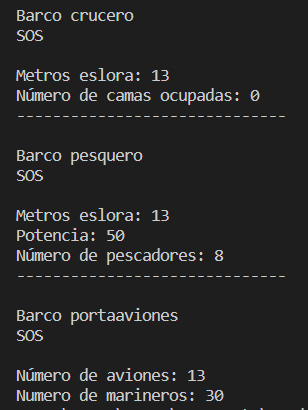

# Examen de Programación de DAW Presencial

**Tabla de contenidos**

-   [**Introducción**](#introducción)
-   [**Enunciado de la segunda parte del examen**](#enunciado-de-la-segunda-parte-del-examen)
-   [**Diagrama UML**](#diagrama-uml)
-   [**Salida de la aplicación**](#salida-de-la-aplicación)

## Introducción

Este es un examen en Java de 2023 realizado por la clase de DAW (Presencial) de Programación en CIFP Francesc de Borja Moll. Los alumnos realizaron el examen con papel y lapiz, pero nuestro profesor nos propuso a nosotros (clase de DAW Intensivo) el reto de hacer el examen directamente con el ordenador.

El examen estaba dividido en dos partes. Dado que nosotros ya hicimos la [primera parte en Python](https://github.com/ncocana/Kata-DNI) hace unos meses, hicimos en su lugar la segunda parte.

## Enunciado de la segunda parte del examen

Diseña un programa que considere la siguiente estructura de barcos.   

Todos los barcos tienen un comportamiento en común: los métodos alarma() y mensajeSocorro(), ¿qué implicaciones tiene esa afirmación a hora de construir barco? Explícalo con tus propias palabras.   

Del barco crucero se quiere guardar los metros de eslora y un contador del número de camas ocupadas. El contador se utilizará para almacenar el número de camas que se vayan creado.   

Del barco portaaviones se desea almacenar el número de aviones y el número de marinos. También queremos los métodos get y set de los atributos correspondientes, ¿Son realmente necesarios? ¿Se utilizan en algún momento? Explícalo con tus propias palabras.   

Del barco pesquero se guardan los metros de eslora, la potencia, el número de pescadores.   

Cada vez que se cree un barco deberá mostrarse un mensaje indicándose los datos del barco creado.   

El método alarma muestra un mensaje indicando desde qué tipo de barco se envía la alarma. Este método podrá ser accedido desde fuera de la clase.   

El método mensaje de socorro invoca al método alarma, y, además, muestra un mensaje a partir de una cadena que recibe por parámetro. Este método podrá ser accedido desde fuera de la clase.   

Haz un diagrama, como el visto en clase de la estructura de clases resultante y completa los métodos correspondientes y crea un programa principal que utilice los diferentes tipos de barcos y ejecuta los mensajes de socorro y alarma de cada uno.   

## Diagrama UML

(imagen)

## Salida de la aplicación

   
